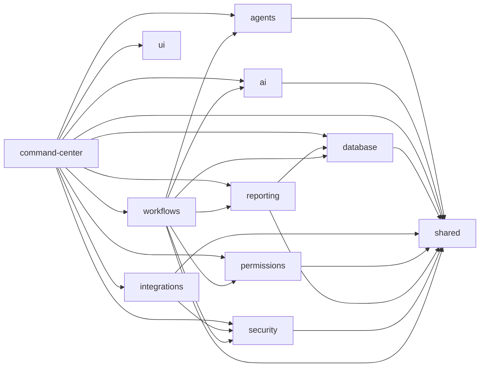

<!-- GENERATED — do not edit by hand. Run: npm run codebase:generate -->

# Catalog (generated)

Generated from commit `454e6d8`. **Grep this file; do not read it whole.**
Purpose, security sensitivity and stability come from `tools/codebase/annotations.json`.

## Modules

| Module | Path | Sensitivity | Stability | Depends on | Consumers | Tests |
| --- | --- | --- | --- | --- | --- | --- |
| `agents` | `agents` | sensitive | stable | shared | command-center, workflows | 0 |
| `ai` | `packages/ai` | sensitive | changing | shared | command-center, workflows | 2 |
| `command-center` | `apps/command-center` | critical | changing | agents, ai, database, integrations, permissions, reporting, security, shared, ui, workflows | — | 2 |
| `database` | `packages/database` | critical | changing | shared | command-center, reporting, workflows | 0 |
| `integrations` | `packages/integrations` | sensitive | stable | security, shared | command-center | 1 |
| `permissions` | `packages/permissions` | critical | changing | shared | command-center, workflows | 3 |
| `reporting` | `packages/reporting` | ordinary | stable | database, shared | command-center, workflows | 2 |
| `security` | `packages/security` | critical | changing | shared | command-center, integrations, workflows | 2 |
| `shared` | `packages/shared` | sensitive | changing | — | agents, ai, command-center, database, integrations, permissions, reporting, security, workflows | 1 |
| `ui` | `packages/ui` | ordinary | temporary | — | command-center | 0 |
| `workflows` | `packages/workflows` | critical | changing | agents, ai, database, permissions, reporting, security, shared | command-center | 3 |

## Dependency graph

## Routes

| Route | Kind | File |
| --- | --- | --- |
| `/` | page | `apps/command-center/app/page.tsx` |
| `/agents` | page | `apps/command-center/app/agents/page.tsx` |
| `/api/cron/daily-brief` | api | `apps/command-center/app/api/cron/daily-brief/route.ts` |
| `/api/jarvis/chat` | api | `apps/command-center/app/api/jarvis/chat/route.ts` |
| `/approvals` | page | `apps/command-center/app/approvals/page.tsx` |
| `/businesses` | page | `apps/command-center/app/businesses/page.tsx` |
| `/businesses/[businessId]` | page | `apps/command-center/app/businesses/[businessId]/page.tsx` |
| `/decisions` | page | `apps/command-center/app/decisions/page.tsx` |
| `/executive` | page | `apps/command-center/app/executive/page.tsx` |
| `/jarvis` | page | `apps/command-center/app/jarvis/page.tsx` |
| `/knowledge` | page | `apps/command-center/app/knowledge/page.tsx` |
| `/login` | page | `apps/command-center/app/login/page.tsx` |
| `/objectives` | page | `apps/command-center/app/objectives/page.tsx` |
| `/projects` | page | `apps/command-center/app/projects/page.tsx` |
| `/reports` | page | `apps/command-center/app/reports/page.tsx` |
| `/settings` | page | `apps/command-center/app/settings/page.tsx` |
| `/tasks` | page | `apps/command-center/app/tasks/page.tsx` |

## Internal tools

`createProject` · `createTask` · `generateDailyBrief` · `getBusinessSummary` · `getOpenTasks` · `getPendingApprovals` · `recordDecision` · `requestApproval` · `searchDocuments` · `updateTask`

## Businesses

`A00` ATLAS · `A01` FORGE · `A02` SIGNAL · `A03` VECTOR · `A04` ORACLE · `A05` TEMPO · `A06` ECHO · `A07` ACADEMY · `A08` VOID

## Agents

`A00-GM` (A00) · `A01-GM` (A01) · `A02-GM` (A02) · `A03-GM` (A03) · `A04-CFO` (A04) · `A05-CD` (A05) · `A06-LD` (A06) · `A07-AD` (A07) · `A08-RSV` (A08) · `JVS-00` (org)

## Migrations

- `supabase/migrations/0001_extensions_enums.sql` — `a77e9aca5c03`
- `supabase/migrations/0002_core_identity.sql` — `e870e0921e2c`
- `supabase/migrations/0003_agents.sql` — `9dad951f6faf`
- `supabase/migrations/0004_work.sql` — `b6e1937b3664`
- `supabase/migrations/0005_documents.sql` — `c0873612a8c6`
- `supabase/migrations/0006_runs_audit.sql` — `08768084681f`
- `supabase/migrations/0007_rls.sql` — `364c33374ed2`
- `supabase/migrations/0008_forge_pilot.sql` — `1ca65ce1d3e9`
- `supabase/migrations/0009_prime_bootstrap.sql` — `98f08332e6ec`

## Security-critical files

| File | Class | Concern | Required tests |
| --- | --- | --- | --- |
| `packages/permissions/src/policy.ts` | critical | Action policy and approval gating; unknown actions must fail closed. | `packages/permissions/tests/policy.test.ts` |
| `packages/permissions/src/authority.ts` | critical | L0-L5 authority comparison. | `packages/permissions/tests/authority.test.ts` |
| `packages/permissions/src/agent-scope.ts` | critical | Agent containment: business scope, allowlist, denylist. | `packages/permissions/tests/agent-scope.test.ts` |
| `packages/workflows/src/tools.ts` | critical | Tool enforcement pipeline; restricted actions must become approvals. | `packages/workflows/tests/tools.test.ts` |
| `packages/workflows/src/orchestrator.ts` | critical | Acting-authority selection; agents must never inherit user authority. | `packages/workflows/tests/orchestrator.test.ts` |
| `packages/workflows/src/classifier.ts` | sensitive | External-action detection must precede any model involvement. | `packages/workflows/tests/classifier.test.ts` |
| `packages/security/src/audit.ts` | critical | Audit event construction with redaction before persistence. | `packages/security/tests/security.test.ts` |
| `packages/security/src/redact.ts` | critical | Secret redaction for anything written to logs or audit. | `packages/security/tests/security.test.ts` |
| `packages/security/src/constant-time.ts` | critical | Constant-time secret comparison without a length oracle. | `packages/security/tests/constant-time.test.ts` |
| `packages/security/src/safe-error.ts` | critical | User-facing error surface; only PublicError messages may reach the browser. | `packages/security/tests/security.test.ts` |
| `packages/security/src/rate-limit.ts` | sensitive | Rate limiting abstraction; in-memory implementation is temporary. | `packages/security/tests/security.test.ts` |
| `packages/security/src/webhooks.ts` | sensitive | HMAC verification interface; no replay protection yet. | `packages/security/tests/security.test.ts` |
| `packages/database/src/clients.ts` | critical | Service-role client construction; must never reach the browser. | `packages/workflows/tests/tools.test.ts` |
| `apps/command-center/lib/prime-claim.ts` | critical | PRIME bootstrap token validation and rate-limit decisions. | `apps/command-center/tests/prime-claim.test.ts` |
| `apps/command-center/lib/cron-auth.ts` | critical | Constant-time bearer check for the scheduled endpoint. | `apps/command-center/tests/cron-auth.test.ts` |
| `apps/command-center/lib/auth.ts` | critical | Identity and membership resolution via the RLS-scoped client. | `apps/command-center/tests/prime-claim.test.ts` |
| `apps/command-center/lib/jarvis.ts` | critical | Server-only service-role singletons; imports server-only. | `apps/command-center/tests/cron-auth.test.ts` |
| `apps/command-center/middleware.ts` | critical | Route gating and session refresh. | `apps/command-center/tests/cron-auth.test.ts` |
| `apps/command-center/app/actions/auth.ts` | critical | Sign-in/up/out and the PRIME claim flow. | `apps/command-center/tests/prime-claim.test.ts` |
| `apps/command-center/app/actions/approvals.ts` | critical | PRIME-only approval transitions, dual-enforced with RLS. | `packages/permissions/tests/policy.test.ts` |
| `supabase/migrations/0007_rls.sql` | critical | All RLS policies and helper functions. | `supabase/tests/rls_verification.sql` |
| `supabase/migrations/0009_prime_bootstrap.sql` | critical | Claim RPC, nonce table, single-PRIME trigger. | `supabase/tests/prime_bootstrap_verification.sql` `supabase/tests/race_prime_claim.sh` |
