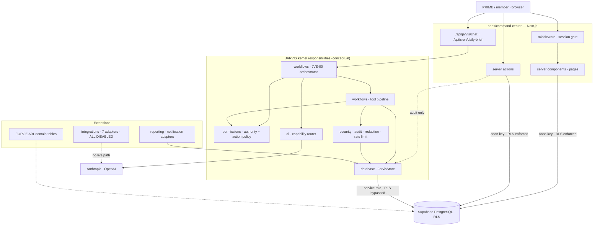

<!--
Type: manual
Canonical for: nothing — source code and migrations are canonical
Update when: a component boundary, trust boundary or known-coupling item changes
Owner: PRIME
-->

# System map — the JARVIS Kernel and its edges

Read when a change **crosses a boundary**. For work inside one module, the
relevant `context/` packet is enough.

> **The kernel is a concept, not a package.** There is no `packages/kernel`
> directory and none is being created during Phase 1.1. This document names
> the responsibilities that behave like a kernel, says where they actually
> live today, and records where reality diverges from the intended boundary.

## Kernel responsibilities and where they live today

| Kernel responsibility       | Current implementation                                       | Notes                                                          |
| --------------------------- | ------------------------------------------------------------ | -------------------------------------------------------------- |
| Identity & session          | `apps/command-center/lib/auth.ts`, `middleware.ts`           | reads memberships from DB per request; no JWT claims           |
| Authority & action policy   | `packages/permissions/src/{authority,policy,agent-scope}.ts` | pure, I/O-free — the cleanest kernel boundary in the system    |
| Data access                 | `packages/database/src/store*.ts` (`JarvisStore`)            | one god-interface; segregation is hardening commit 10          |
| Audit & redaction           | `packages/security/src/{audit,redact}.ts` + `audit_logs`     | critical-vs-telemetry split exists only for PRIME claim so far |
| Approvals                   | `packages/workflows/src/tools.ts` + `approvals` table        | restricted actions become records; **no executors exist**      |
| Events                      | `system_events` table + ad-hoc `createSystemEvent` calls     | not yet a typed, centralised emitter (commit 8)                |
| AI capability access        | `packages/ai/src/{router,structured}.ts`                     | capability→route→env-configured model                          |
| Agent definitions & prompts | `agents/` + `agents` table                                   | prompts in files, capabilities in DB                           |
| Orchestration               | `packages/workflows/src/orchestrator.ts`                     | ~500-line intent switch; split is commit 9                     |

**Extensions** (replaceable, should register against the kernel rather than
couple to it): business domains such as FORGE (A01), integration adapters
(`packages/integrations`, all disabled), notification channels
(`packages/reporting/src/notify.ts`), and future approval executors.

## Data flow



## Trust boundaries

1. **Browser ↔ server.** The browser holds only the Supabase URL and anon key.
   Service-role key, AI keys, cron secret and the PRIME setup token are
   server-only. `createServiceClient()` refuses to construct in a browser
   context; `lib/jarvis.ts` imports `server-only`.
2. **User path vs orchestrator path.** Pages and server actions use the
   session-bound anon client — **the database enforces access via RLS**. The
   orchestrator path uses the service role and therefore must perform
   application-level permission checks _before_ touching the store. Any new
   `getStore()` / `createServiceClient()` call site without a preceding check
   is a defect.
3. **Model ↔ system.** Models never hold permissions, never receive database
   or service-role access, and never choose their own authority. They produce
   Zod-validated output; the tool pipeline re-derives authority independently.
4. **Extension ↔ kernel.** Integrations must not bypass permissions, approvals
   or audit. All seven adapters are disabled and have no live network path.

## Known coupling (current violations, not intentions)

| #   | Violation                                                            | Where                                                                                             | Resolution                                  |
| --- | -------------------------------------------------------------------- | ------------------------------------------------------------------------------------------------- | ------------------------------------------- |
| 1   | Business domain inside kernel migrations                             | FORGE tables in `supabase/migrations/0008_forge_pilot.sql`                                        | future extension boundary; not in Phase 1.1 |
| 2   | UI formatting inside domain code                                     | `formatToolResult` / `formatExecuted` in `workflows/src/orchestrator.ts`                          | hardening commit 9                          |
| 3   | Authorization policy split across code and DB                        | `ACTION_POLICIES` constants vs unused `permissions`/`role_permissions`/`agent_permissions` tables | hardening commit 5                          |
| 4   | Business/agent definitions duplicated three ways                     | `shared/src/constants.ts`, `supabase/seed/seed.sql`, `database/src/store-memory.ts`               | hardening commit 6                          |
| 5   | `JarvisStore` spans six unrelated domains                            | `database/src/store.ts`                                                                           | hardening commit 10                         |
| 6   | Event emission not centralised or typed; user and agent paths differ | `task.created` fires from server actions, not from the agent tool path                            | hardening commit 8                          |
| 7   | Two error-handling regimes                                           | `Result<T,E>` in `ai`/`shared` vs throws in `database`                                            | hardening commit 15                         |

## Intended future boundary (not implemented)

Extensions would register a manifest with the kernel — domain tables, action
types, event types, tools, agent code, migrations — and receive scoped
services (store, permission checks, event emission, audit, AI capability
requests, approval requests) in return. Kernel never imports an extension;
extensions never import each other; cross-business needs an explicit shared
service. Acceptance test for the design: **FORGE can be removed without
touching kernel code.** This is a documented direction only — see
`CURRENT_STATE.md` for what is actually approved.

## Repository layout

```
jarvis-core/
├── apps/command-center     Next.js 15 App Router · 14 pages · 2 API routes
├── packages/
│   ├── shared              constants, Zod schemas, Result type
│   ├── permissions         authority, action policy, agent scope  (pure)
│   ├── security            redaction, audit events, rate limit, constant-time, webhooks
│   ├── database            typed rows, clients, JarvisStore (supabase + memory)
│   ├── ai                  provider adapters, capability router, structured output
│   ├── workflows           classifier, tool pipeline, JVS-00 orchestrator
│   ├── reporting           daily brief, notification adapters
│   ├── integrations        adapter contract + 7 disabled adapters
│   └── ui                  Card, Badge, EmptyState, StatTile
├── agents/                 master constitution + 10 versioned role cards
├── supabase/               9 migrations · seed · RLS + bootstrap verification
└── docs/                   setup · security · operations · codebase (JEKS)
```
